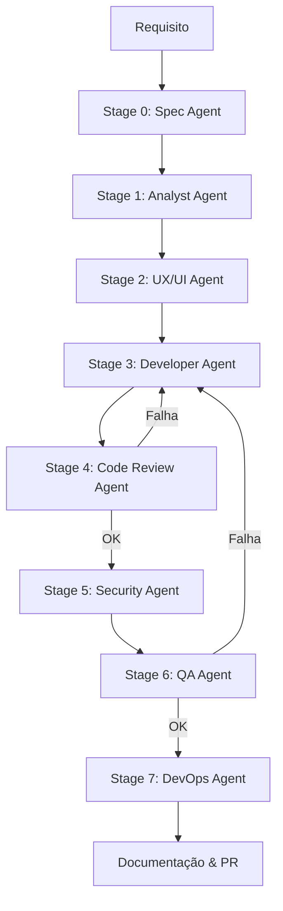

# 🚀 Pipeline Executor

Pipeline de desenvolvimento automatizado orientado por IA. A partir de um requisito em linguagem natural, o sistema aciona uma cadeia de agentes LLM especializados que percorre todas as etapas de um ciclo de desenvolvimento — especificação, análise, design UX, código, code review, segurança, QA e DevOps — e integra o resultado diretamente em um repositório GitHub via Pull Request.

---

## ✨ Destaques (Features)

- **Fluxo Multiestágio (8 Estágios):** Processo completo desde a especificação até o planejamento de deploy.
- **Resiliência e Retomada (Resume/Retry):** Capacidade única de retomar execuções de pontos de falha ou reexecutar estágios específicos sem perder o progresso anterior.
- **Monitoramento em Tempo Real (SSE):** Acompanhamento live da execução via Server-Sent Events, integrado ao dashboard.
- **QA Runner com Evidências Reais:** Execução real de testes (Jest/Vitest/Mocha) em workspaces isolados, coletando cobertura de código e linting.
- **Gateways de Qualidade Determinísticos:** Além do julgamento da IA, o pipeline valida critérios técnicos como regressão de cobertura e padrões de arquitetura.
- **Gestão de Workspaces:** Clone dinâmico de repositórios, alocação de portas e integração automática de código (Writeback Validation).
- **Documentação Automática:** Geração de artefatos Markdown para cada etapa da execução.

---

## 🛠️ Tecnologias (Tech Stack)

- **Runtime:** Node.js 20+ (ES Modules)
- **Engine de IA:** OpenAI API (GPT-4o / GPT-4o-mini)
- **Servidor:** Express.js com Helmet e Rate Limiting
- **Automação Git:** Octokit (@octokit/rest) e comandos Git nativos
- **Qualidade/QA:** Istanbul/C8 para cobertura, Playwright para testes de UI
- **Logs:** Pino/Logger customizado com JSON estruturado

---

## 🏗️ Como funciona

O pipeline recebe um requisito, analisa o repositório alvo e executa agentes em sequência. Cada agente usa um `SKILL.md` como system prompt especializado e gera documentação estruturada da sua etapa.



### Detalhamento dos Estágios

- **Stage 0 (Spec Agent):** Transforma o requisito bruto em uma especificação técnica estruturada.
- **Stage 1 (Analyst Agent):** Gera user stories, requisitos técnicos detalhados e critérios de aceite.
- **Stage 2 (UX/UI Agent):** Cria especificações de design, jornadas do usuário e definições de componentes.
- **Stage 3 (Developer Agent):** Gera o código-fonte e os testes automatizados correspondentes.
- **Stage 4 (Code Review Agent):** Valida padrões, segurança e arquitetura. Pode solicitar correções ao Developer.
- **Stage 5 (Security Agent):** Checklist rigoroso de Privacy by Design e Security by Design (OWASP).
- **Stage 6 (QA Agent):** Executa testes reais e valida cobertura mínima (80%) e ausência de regressões.
- **Stage 7 (DevOps Agent):** Planeja o deploy, health checks e estratégias de rollback.

### Mecanismo de Resiliência (Resume/Retry)
Diferente de pipelines lineares simples, o **Pipeline Executor** mantém checkpoints de cada transição. Se uma execução falha, você pode:
1. **Inspecionar:** Ver exatamente onde falhou via `/api/pipeline/:id/inspection`.
2. **Corrigir:** Ajustar o contexto ou o código.
3. **Retomar:** Chamar `/resume` para continuar do último ponto estável ou `/retry-stage` para tentar novamente o estágio problemático.

---

## 🚀 Instalação e Uso

### Requisitos
- Node.js 20+ e npm
- Git instalado no PATH
- OpenAI API Key

### Setup
```bash
git clone https://github.com/ospm1970/pipeline-executor.git
cd pipeline-executor
npm install
cp .env.example .env
# Edite .env com suas credenciais
npm start
```

O servidor estará disponível em `http://localhost:3001`.

---

## ⚙️ Configuração (.env)

| Variável | Descrição | Padrão |
|----------|-----------|---------|
| `OPENAI_API_KEY` | Chave da OpenAI (Obrigatório) | - |
| `API_KEY` | Chave para autenticar requisições no header `x-api-key` | - |
| `GITHUB_TOKEN` | Token para operações em repositórios externos | - |
| `PORT` | Porta do servidor Express | 3001 |
| `OPENAI_MODEL` | Modelo usado pelos agentes | `gpt-4.1-mini` |
| `LOG_LEVEL` | Nível de verbosidade (info, debug, warn, error) | `info` |
| `ALLOWED_ORIGINS` | Origens permitidas para CORS | `http://localhost:3001` |

---

## 📋 Scripts NPM

- `npm start`: Inicia o servidor de produção.
- `npm run dev`: Inicia o servidor em modo watch (desenvolvimento).
- `npm test`: Executa os testes de integração nativos do Node.js.
- `npm run test:ui`: Executa testes de interface com Playwright.
- `npm run test:plan-validation`: Valida planos de execução.
- `npm run monitor:pipeline`: Utilitário CLI para monitorar pipelines ativos.
- `npm run pipeline:resume`: Utilitário para retomar pipelines via linha de comando.

---

## 🔌 API Principais

### Pipeline Externo (GitHub)
`POST /api/pipeline/external`
```json
{
  "repositoryUrl": "https://github.com/org/repo",
  "requirement": "Adicionar paginação no endpoint /api/products",
  "autoCommit": true
}
```

**Exemplo de Resposta (Sucesso):**
```json
{
  "executionId": "exec-1234567890",
  "pipelineId": "pipeline-abc",
  "pullRequest": {
    "url": "https://github.com/org/repo/pull/42",
    "number": 42
  },
  "status": "completed"
}
```

**Exemplo de Bloqueio (QA):**
```json
{
  "status": "blocked_by_qa",
  "reason": "Cobertura insuficiente: 62% (mínimo 80%)",
  "resumeEligible": true,
  "failedStage": "qa"
}
```

### Gestão de Execuções
- `GET /api/pipeline`: Lista histórico de pipelines.
- `GET /api/pipeline/:id/stream`: Stream SSE de progresso.
- `GET /api/pipeline/:id/inspection`: Detalhes técnicos e checkpoints.
- `POST /api/pipeline/:id/resume`: Comando de retomada.

---

## 🎨 Dashboard
O sistema inclui uma interface web integrada para monitoramento:
- `http://localhost:3001/index.html`: Interface de disparo e histórico.
- `http://localhost:3001/dashboard.html`: Visualização detalhada de métricas e status dos agentes.

---

## 🛡️ Gateways de Qualidade

### Code Review (Stage 4)
Loop de até 2 tentativas de correção automática para problemas de arquitetura, padrões NestJS/React e segurança básica.

### Security (Stage 5)
Validação de *Privacy by Design* e *Security by Design*, verificando vulnerabilidades OWASP e conformidade LGPD.

### QA Runner (Stage 6)
O gateway mais rigoroso. Executa testes reais no projeto alvo e coleta resultados estruturados:
```json
{
  "approved": true,
  "coverage_percentage": 87.4,
  "test_execution": { "total": 42, "passed": 42, "failed": 0 },
  "coverage_delta": +2.3
}
```

---

## 📂 Estrutura de Pastas

```
├── skills/           # System Prompts (SKILL.md) de cada agente
├── data/             # Persistência de execuções (checkpoints JSON)
├── docs/             # Documentação gerada pelos agentes (Markdown)
├── public/           # Frontend (Dashboard e UI)
├── tests/            # Suíte de testes de integração e UI
├── orchestrator.js   # Cérebro do sistema e gestão de estados
├── agents.js         # Definições base dos agentes LLM
└── qa-runner.js      # Executor de testes isolados
```

---

## 📄 Licença

MIT
